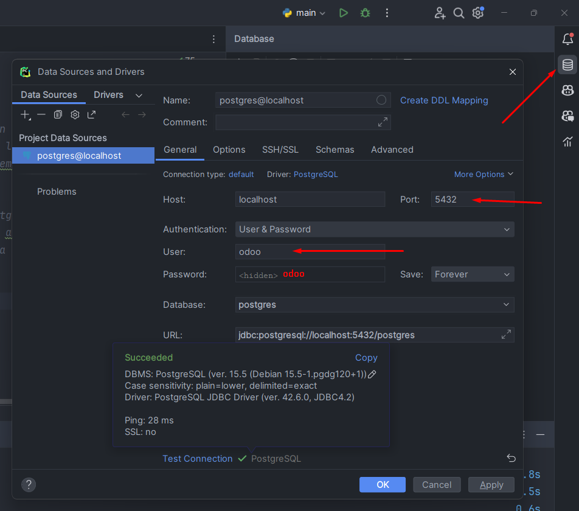
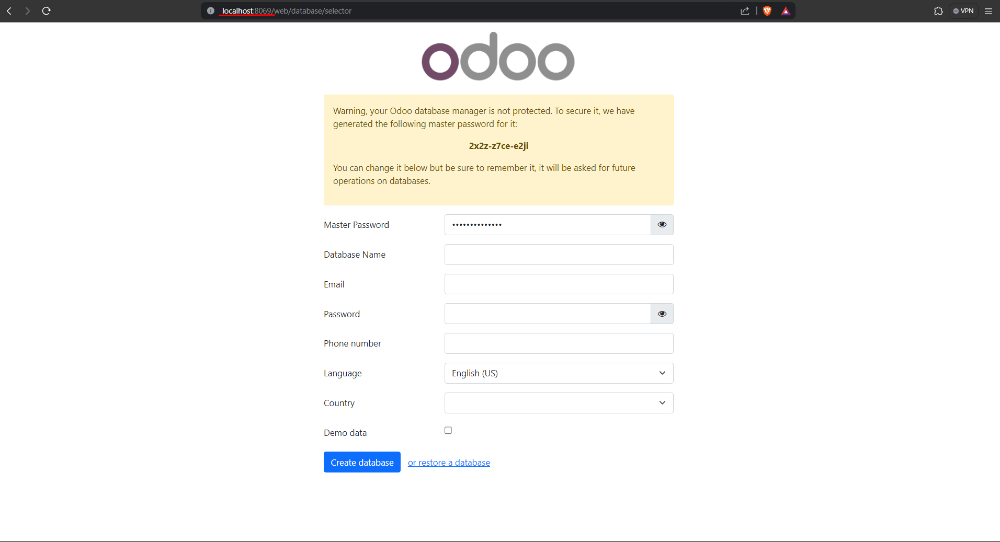
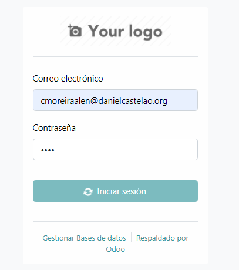
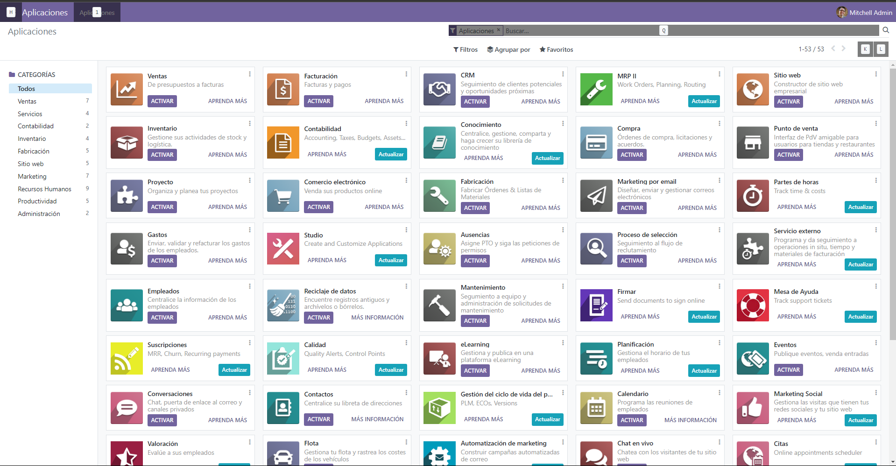
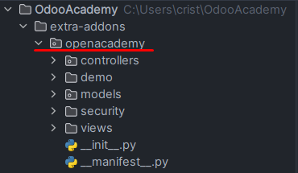
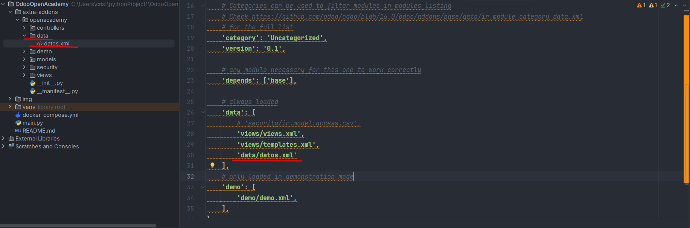
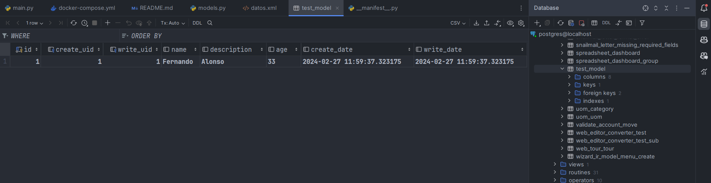
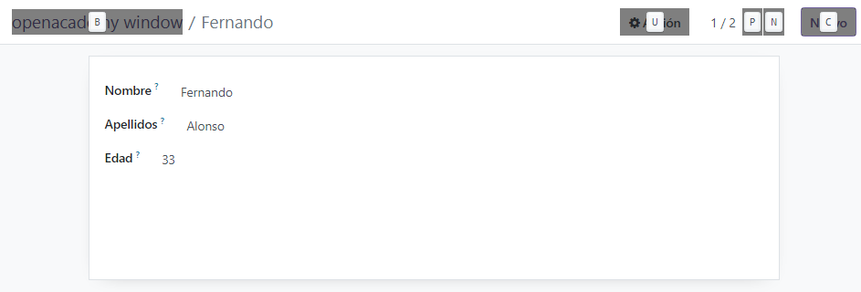
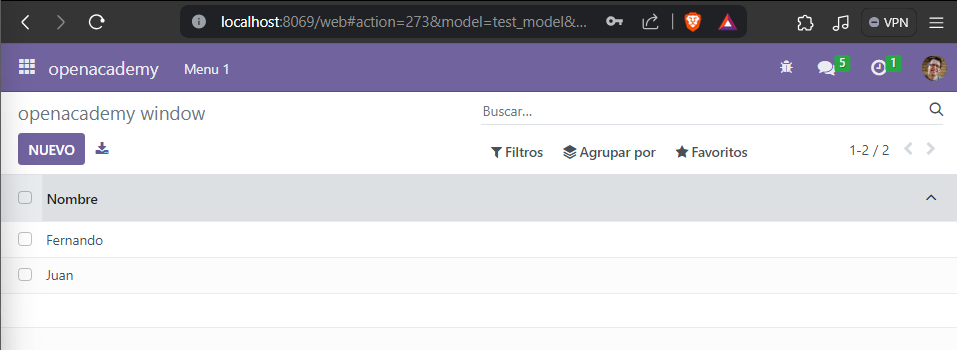
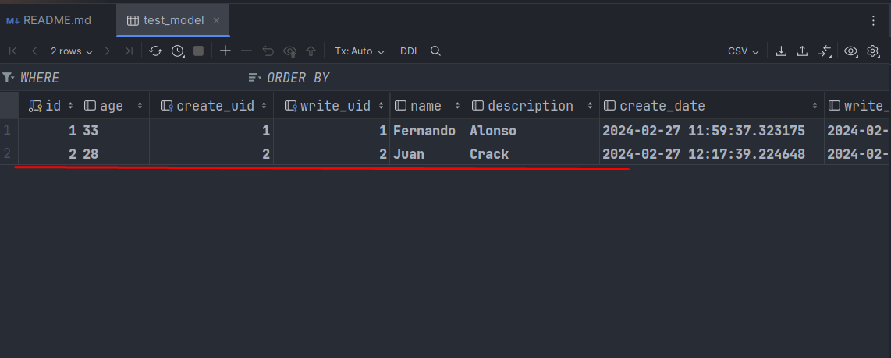

# Tarea: Entorno de desarrollo en Odoo y creación de módulo

1.  Docker con Odoo + PostgreSQL
2. Acceso a la Base de Datos desde PyCharm 
3. Creación de tablas
4. Edición de datos en formulario

## 1. Docker Compose:
### Odoo 
```dockerfile
version: '3.1'
services:
  # servicio de la app - python
  web:
    # servicio de la app con su version
    image: odoo:16.0
    # servicio de la bd que utiliza la app
    # esta app depende de este servicio
    # no arrancara hasta que el servicio este elevantado
    depends_on:
      - db
    volumes:
      - ./extra-addons:/mnt/extra-addons
    # mapeo de puertos para poder acceder desde mi maquina
    ports:
      - "8069:8069"
    environment:
      # el nombre o la IP del gestor de la base de datos
      # tiene que ser el mismo nombre que le pongamos al sevicio de la bd
      - HOST=db

      # --POR DEFECTO, SI NO SE PONGE NADA ODOO COGE POR DEFECTO "postgres"--
      # usuario administrador/superusuario del gestor de base de datos
      # tiene que coincidir con "POSTGRES_USER" de abajo
      - USER=odoo
      # constraseña del administrador del gestor de base base de datos
      # tiene que coincidir con "POSTGRES_PASSWORD" de abajo
      - PASSWORD=odoo
      
   ```
### PostgresSQL
```dockerfile
  db:
    # servicio de la bd de la app con su version
    image: postgres:15
    # variables de entorno de la imagen postgres
    environment:
      # nombre de la base de datos
      - POSTGRES_DB=postgres
      # contraseña del superusuario
      # no se puede arrancar el servicio sin un valor
      # para conectarme al motor de bd me pide la contraseña si estoy fuera de la maquina
      # si estoy dentro de la maquina, el sistema en confia en mi, por lo que no me pide contraseña
      - POSTGRES_PASSWORD=odoo
      # nombre del superusuario
      # si no pongo nada por defecto pone "postgres"
      # usuario que coge odoo por defecto para administrar la bd. posteriormente odoo va a coger ese usuario para
      # crear una base de datos propia que va a ser la que va a utilizar.
      - POSTGRES_USER=odoo
    ports:
      - "5432:5432"
  
  ```

## 2. Acceso a la Base de Datos desde PyCharm

Para establecer conexión con la base de datos, debemos de crear una base de datos y
debería de quedar de la siguiente manera:



Como podemos ver al final de la imagen, la conexión se ha establecido correctamente.

## 3. Lanzamos el docker compose.

Para realizar esta acción debemos de ejecutar el siguiente comando:

`docker compose up -d`, este comando nos permite levantar los servicios que se encuentran en el archivo `docker-compose.yml`.
Para comprobar que los servicios se han levantado correctamente, debemos ir al buscador y escribir en la barra de búsqueda:
'localhost:8069', si todo ha ido bien, nos debería de aparecer la siguiente pantalla:



Y así es como lo dejamos configurado y le damos a `Create Database`:


La siguiente pantalla que nos aparecerá una vez tengamos todo bien configurado e iniciemos sesión será:




## 4. Creación de modulo y tabla

Para la creación de un módulo, debemos de seguir los siguientes pasos:

1. `docker exec -u root -it odooacademy-web-1 /bin/bash`
2. `cd /mnt/extra-addons/`
3. `odoo scaffold academy`
4. `chmod -R 777 openacademy`
5. `exit`

Una vez puestos estos comandos frbrmod reiniciar el proyecto y nos debería de aparecer el módulo que hemos creado.



Para crear una tabla, nos dirigimos a la carpeta `models` luego a `models.py` y le añadimos el siguiente código:

```python
# -*- coding: utf-8 -*-
from odoo.odoo import models,fields


class TestModel(models.Model):
    _name = "test_model"
    _description = "Modelo de prueba"

    name = fields.Char(string="Nombre")
    description = fields.Text(string="Apellido")
    edad = fields.Integer(string="Edad")
```

Una vez añadido el código, debemos de reiniciar el contendor y actualizar. A continuacion, nos debería de aparecer la tabla que hemos creado.

Creamos una carpeta llamada data y dentro un archivo datos.xml con el siguiente contenido:

```xml
<odoo>
    <data>
        <record model="test_model" id="openacademy.nombres">
            <field name="name">Fernando</field> <!-- El nombre debe ser el mismo que la variable del modelo -->
            <field name="description">Alonso</field> <!--El nombre debe ser el mismo que la variable del modelo-->
            <field name="age">33</field> <!--El nombre debe ser el mismo que la variable del modelo-->
        </record>
    </data>
</odoo>
```
Una vez creado el archivo y introducido nuestros datos, tenemos que añadirlo al `manifest.py`



Luego reiniciamos el contendor y actualizamos la base de datos. Una vez nos
esté funcionando todo correctamente, nos debería de aparecer la siguiente tabla:

 

Bueno, por el momento vamos bastante bien, ahora hay que hacer que se vea en el odoo estos datos.
Para ello debemos de editar el archivo `views.xml` y añadir el siguiente código:

```xml
<odoo>
  <data>
    <!-- explicit list view definition -->
<!--
    <record model="ir.ui.view" id="openacademy.list">
      <field name="name">openacademy list</field>
      <field name="model">openacademy.openacademy</field>
      <field name="arch" type="xml">
        <tree>
          <field name="name"/>
          <field name="value"/>
          <field name="value2"/>
        </tree>
      </field>
    </record>
-->

    <!-- actions opening views on models -->

    <record model="ir.actions.act_window" id="openacademy.action_window">
      <field name="name">openacademy window</field>
      <field name="res_model">test_model</field>
      <field name="view_mode">tree,form</field>
    </record>


    <!-- server action to the one above -->
<!--
    <record model="ir.actions.server" id="openacademy.action_server">
      <field name="name">openacademy server</field>
      <field name="model_id" ref="model_openacademy_openacademy"/>
      <field name="state">code</field>
      <field name="code">
        action = {
          "type": "ir.actions.act_window",
          "view_mode": "tree,form",
          "res_model": model._name,
        }
      </field>
    </record>
-->

    <!-- Top menu item -->

    <menuitem name="openacademy" id="openacademy.menu_root"/>

    <!-- menu categories -->

    <menuitem name="Menu 1" id="openacademy.menu_1" parent="openacademy.menu_root"/>
    <menuitem name="Menu 2" id="openacademy.menu_2" parent="openacademy.menu_root"/>

    <!-- actions -->

    <menuitem name="List" id="openacademy.menu_1_list" parent="openacademy.menu_1"
              action="openacademy.action_window"/>
<!--
    <menuitem name="Server to list" id="openacademy" parent="openacademy.menu_2"
              action="openacademy.action_server"/>
-->
  </data>
</odoo>

```

Además debemos de cambiar en la carpeta `security` modificaremos el archivo `ir.model.access.csv` y añadiremos el siguiente código:

```csv
id,name,model_id:id,group_id:id,perm_read,perm_write,perm_create,perm_unlink
access_openacademy_openacademy,openacademy.openacademy,model_test_model,base.group_user,1,1,1,1
```

Ahora debemos de reiniciar otra vez el contendor y actualizamos la base de datos. Volvemos a nuestro navegador
seleccionaremos **Aplicaciones** y después seleccionamos **OpenAcademy**, nos deberá de aparecer esto:



Ahora añadiremos uno nuevo registro, clicando en el boton de `Nuevo`.


Así se verá nuestro nuevo registro en Odoo y en nuestra base de datos de PyCharm:





### Bueno y hasta aquí este maravilloso proyecto propuesto por nuestro profesor.
#### Cualquier cosa que necesiteis, no dudeis en preguntar. ¡UN SALUDO!